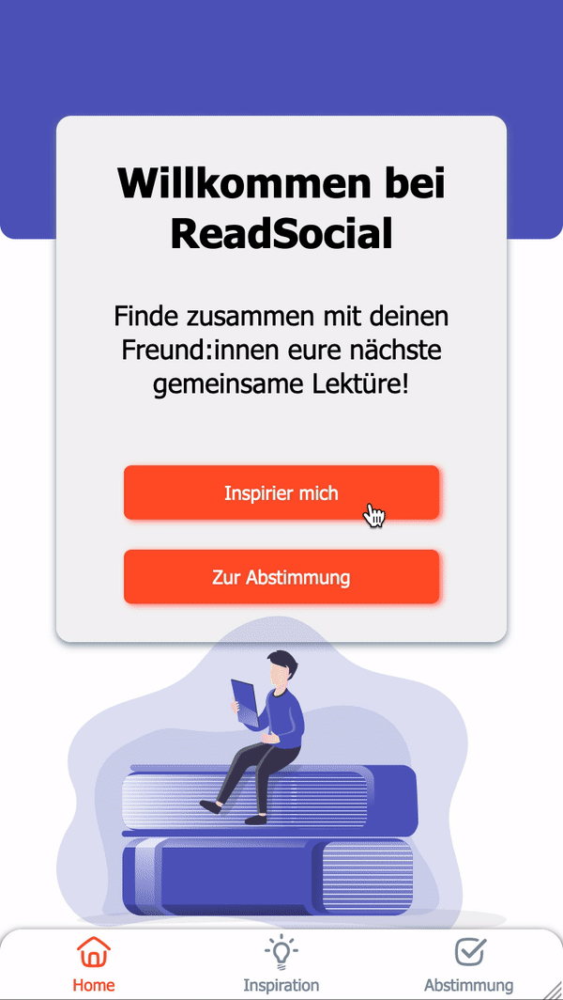

# ReadSocial 

## About ReadSocial

ReadSocial is an app that simplifies the coordination of book clubs. No more endless discussions and tedious research!
ReadSocial contains all the essential information about current reading recommendations clearly arranged in one place. Users can browse, favorite, organize and ultimately decide which titles they will nominate for the coming month. All book club members then vote on this so-called shortlist, so that in the end the book with the most votes is chosen as the next read.

## Whats in it?

create-react-app // React // Javascript // Styled components // Storybook // Testing library // Node.js // Express // nodemon // MongoDB // mongoose

## Running the project

You can clone my repository using:

$ git clone https://github.com/eileenfuerstenau/capstone.git

## Available Scripts

`npm start`
Runs the app in the development mode.
Open http://localhost:3000 to view it in the browser.

`npm test`
Launches the test runner in the interactive watch mode.
See the section about running tests for more information.

## Demo

